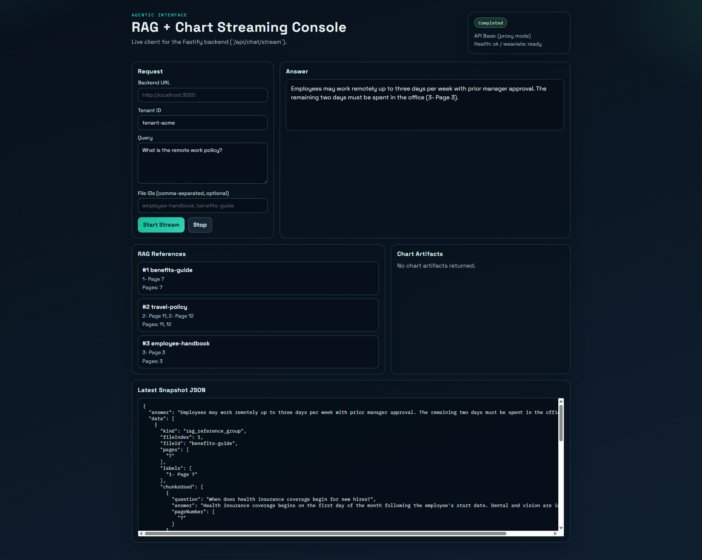
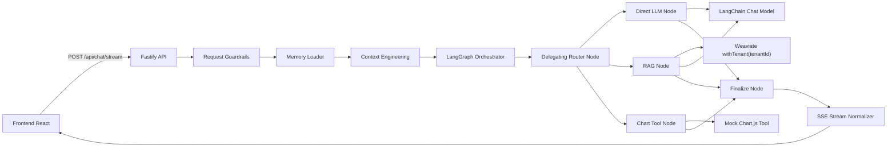
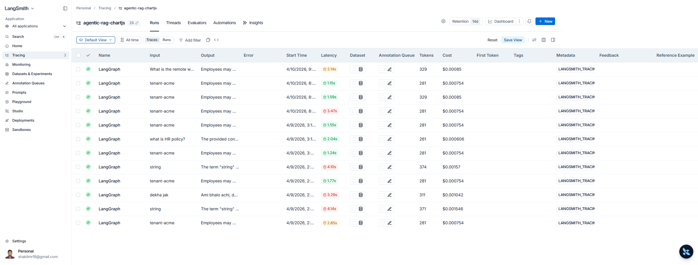

# InsightPilot: Multi-Tenant Agentic Intelligence API (RAG + Chart Streaming)

Production outcome: convert enterprise document questions into trustworthy, source-cited answers and optional chart artifacts through one streaming API.

## Specific Problem This Solves
- Teams need fast answers from internal docs, but raw LLM responses are not tenant-safe and often lack source provenance.
- Product teams also need structured outputs (for UI rendering), not only plain text.
- This system provides tenant-isolated retrieval, explicit references (`fileId` + pages), optional chart config generation, and incremental streaming for responsive UX.

## System Design



## Core Features
- Node.js end-to-end backend (`Fastify`, `LangGraph`, `LangChain`, `weaviate-client`).
- Multi-tenant Weaviate collection with explicit tenant scoping (`withTenant(tenantId)`).
- Delegating agent supports:
1. direct answer
2. RAG-only
3. chart-only
4. mixed RAG + chart (parallel or sequential)
- Streaming API contract: `data: { answer, data[] }` snapshots over SSE.
- Swagger UI docs (`/docs`) and OpenAPI JSON (`/docs/json`).
- Guardrails for identifier validation, payload limits, and prompt-injection/exfiltration filtering.
- Tenant memory persistence (`.runtime/memory`) for short-term continuity.
- Context engineering with token budgeting to bound prompt size.
- Docker Compose one-command startup with hot reload for backend and frontend.

## Multi-Tenancy at Data Level
- Collection: `TenantQaChunk` (created by `scripts/create-schema.ts`).
- Multi-tenancy: enabled (`autoTenantCreation: false`, `autoTenantActivation: true`).
- Properties:
1. `fileId` (`text`, `indexSearchable: false`, `indexFilterable: true`)
2. `question` (`text`, searchable)
3. `answer` (`text`, searchable)
4. `pageNumber` (`text[]`, not searchable)
- Seed data: at least 3 fictional records inserted via `scripts/seed.ts` under tenant `tenant-acme`.
- Runtime isolation: all retrieval operations call `client.collections.use(...).withTenant(tenantId)`.

## Agent Runtime Controls
### Guardrails
- File: `src/guardrails/request.guardrails.ts`
- Blocks malformed tenant/file IDs, too-large query payloads, and high-risk injection/exfiltration prompts.

### Memory
- File: `src/memory/chat-memory.store.ts`
- Persists bounded per-tenant Q/A history in `.runtime/memory/<tenant>.json`.

### Context Engineering
- File: `src/context/context-engineering.ts`
- Estimates token usage, trims query to budget, and injects bounded recent memory context.

## Quick Start
Prerequisites:
- Docker Engine/Desktop + Docker Compose v2
- `.env` at repository root (copy from `.env.example`)
- valid `OPENAI_API_KEY`

Run everything:
```bash
docker compose up
```

Services:
- Weaviate: `http://localhost:8080`
- Backend API: `http://localhost:3000`
- Swagger UI: `http://localhost:3000/docs`
- Frontend: `http://localhost:5173`

## API Contract
Endpoint: `POST /api/chat/stream`

Request:
```json
{
  "tenantId": "tenant-acme",
  "query": "Show remote work policy and visualize it",
  "fileIds": ["employee-handbook"]
}
```

SSE response shape:
```text
data: {"answer":"...","data":[...]}

event: done
data: {}
```

`data[]` includes one or both:
- `rag_reference_group`
- `chartjs`

## How to Check LangSmith Traces
### 1) Configure env
In `.env`, set:
- `LANGSMITH_TRACING=true`
- `LANGSMITH_API_KEY=<your_key>`
- `LANGSMITH_PROJECT=agentic-rag-chartjs` (or your own project name)
- `LANGSMITH_ENDPOINT=https://api.smith.langchain.com`

### 2) Start stack and send traffic
```bash
docker compose up
curl -N -X POST "http://localhost:3000/api/chat/stream" ^
  -H "Content-Type: application/json" ^
  -H "Accept: text/event-stream" ^
  -d "{\"tenantId\":\"tenant-acme\",\"query\":\"What is remote work policy?\"}"
```

### 3) Verify in LangSmith UI
- Go to `https://smith.langchain.com`
- Open the project from `LANGSMITH_PROJECT`
- Expected trace tree:
1. root graph run
2. router node run
3. rag/direct/chart node runs (based on route)
4. LLM runs (`ChatOpenAI`) and tool runs (`generate_chartjs_config`)
5. finalize node run

### 4) Verify backend startup log
- Backend log prints whether LangSmith is enabled and project name on startup.

## How to Verify Weaviate Schema and Seed
```bash
curl http://localhost:8080/v1/schema
curl http://localhost:8080/v1/schema/TenantQaChunk/tenants
```

Example data query:
```bash
curl -X POST "http://localhost:8080/v1/graphql" ^
  -H "Content-Type: application/json" ^
  -d "{\"query\":\"{ Get { TenantQaChunk(tenant: \\\"tenant-acme\\\") { fileId question answer pageNumber } } }\"}"
```

## Development Commands
```bash
docker compose ps
docker compose logs -f backend
docker compose logs -f frontend
docker compose logs -f weaviate
docker compose down
docker compose down -v
```

Backend local:
```bash
npm install
npm run setup
npm run dev
```

Frontend local:
```bash
cd frontend
npm install
npm run dev
```

## Test
```bash
npm test
```

## Troubleshooting
### Swagger "Failed to fetch" on SSE
- Use same-origin docs URL (`http://localhost:3000/docs`).
- Prefer frontend client or cURL for SSE validation.
- Hard refresh browser cache (`Ctrl+F5`) after backend changes.

### OpenAI 401
- Check `OPENAI_API_KEY` in `.env`.
- Recreate backend container after env change:
```bash
docker compose up -d --force-recreate backend
```

### Weaviate not healthy
```bash
docker compose logs weaviate --tail 200
```
